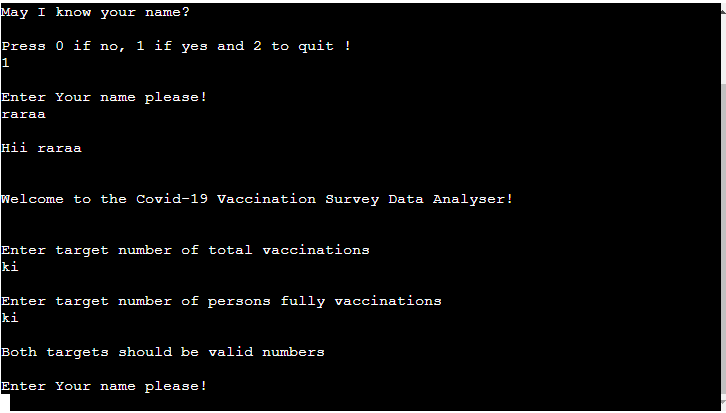
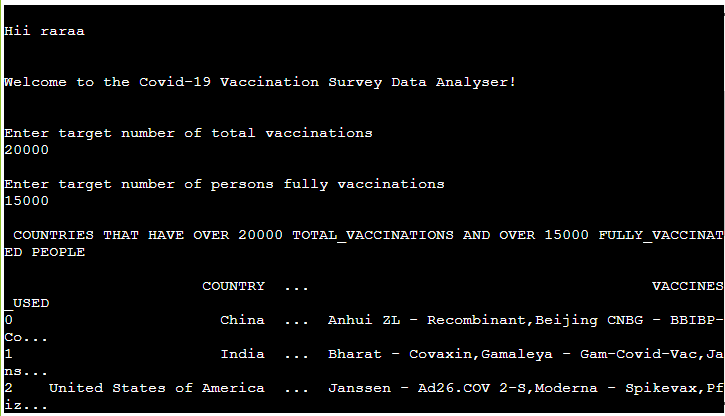
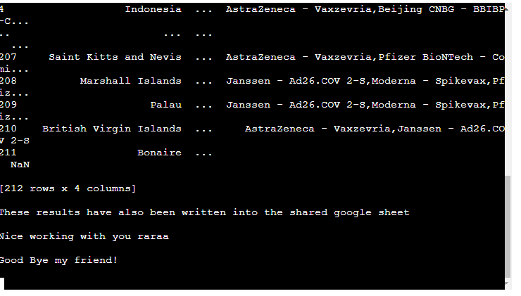
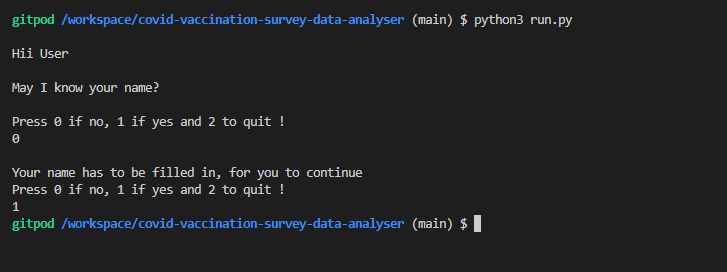

# COVID-19 Vaccine Survey Data Analyzer (CVSDA)

1. ## Introduction

The CVSDA is a command-line interface application built purely in python, that interacts with a user who avails a CSV (comma separated values) list of covid-19 vaccination data around the world.

### Application Goal

To gather insights from covid-19 vaccination survey data results, as the world recovers from covid and continues to fight against the coronavirus.

### Target Audience

* Travelers who might want to tour well vaccinated countries.

* Researchers of vaccines used globally.

* International Health organizations tracking global vaccination.

* Vaccine Manufacturers tracking vaccines used globally.

### User Stories

* As a Traveler, I want to know which countries have the most vaccinated population.

* As a Researcher, I want to know which vaccines have been used the most in the world.

* As an International Health Organization, we would want to know which countries are vaccinating their populations and with which vaccines.

* As a vaccine manufacturer, I want to know which vaccines are being used on a large scale globally.

2. ## Structure
-------
 The features involved in the CVSDA application include the following.

** The main menu**

* The user is prompted to identify him/herself before he/she can access the data analysis module of the application.

1. ** Enter Zero **

* The option allows the user to select no as an answer after request by the application to enter name. With this option, the application with further prompt the user to enter their name if they are to continue using the application.

** Enter Two **

* The option 2 allows the user to quit using the application in case they do not feel like providing their name or credentials to the application.

** Enter One **

* The option 1 allows the user to enter their name after which they can proceed to analyze the covid data based on what numbers they choose as criteria.

** Name Validation**

The application checks the input that is manually input by the user. The application then goes a head to check that the name input by the user has at least 5 characters. Anything less than the 5 charachters returns a message requesting for the user to set the name to right number of characters.

** Data Analysis**

* The application allows the user to enter data in the form of intergers or numbers for analysis after the user has provided the correct name format. After identifying the user with a username, the application prompts the user to enter criteria for analysis on the provided data set. If the user provides anything other than that, the application returns a message indicating invalid input.

** results **

* The criteria is in the form of integers representing a target number that has to be met, that is, the number of vaccinations carried out by countries in the survey data and also the number of fully vaccinated people in the participating countries.

** Analyzed file and closing message **

* The application then analyzes and iterates through each line of the provided data set for countries that meet the user’s desired criteria, compiles and displays a list of these countries in descending order by the total vaccinations carried out.

* The compiled list is then written as a csv file in a google sheet where it can be accessed by an authorized user or administrator and the program comes to an end.

3. ## Logical Flow
----------

** The Overview flow chart**

** The Break down of Getting Username flow chart **

** The Criteria for analysis flow chart **

** The process of analyzing data flow chart **

4. ## Testing and Validation
---------
** Testing **

* The application was tested considering the different user inputs. The username was tested to ensure that it has at least 5 characters or more. Anything below that returned an invalid message.

* The analysis application was also tested to ensure that only numbers were entered by the users and the application passed successfully.

* The application returns the correct data for total vaccinations and total number of persons vaccinated based on the criteria provided by the user.

** Pep8 Validation **
* All python code was ran through pep8online.com validator and any warnings or errors were fixed. Code then validated successfully.

### Bugs and fixes

* The bug was fixed by adding validations in both the validate and analyze functions.

5. ## Deployment
---------
### version control

* The site was created using the Visual Studio Code editor and pushed to github to the remote repository covid-vaccination-survey-data-analyser.

The following git commands were used throughout development to push code to the remote repo:

* git add <file> - This command was used to add the file(s) to the staging area before they are committed.

* git commit -m "commit message" - This command was used to commit changes to the local repository queue ready for the final step.

* git push - This command was used to push all committed code to the remote repository on github.

### Heroku Deployment

The following steps were followed to deploy this project to Heroku:

* Go to Heroku and click "New" to create a new app.

* Choose an app name and region region, click "Create app"

* Go to "Settings" and navigate to Config Vars. Add the following config variables:
   * PORT : 8000
* Navigate to Buildpacks and add buildpacks for Python and NodeJS (in that order).

* Navigate to "Deploy". Set the deployment method to Github and enter repository name and connect.

* Scroll down to Manual Deploy, select "main" branch and click "Deploy Branch".

* The app will now be deployed to heroku

6. ## Credits
-------
* W3C Schhols for functions usednin this python command line terminal application https://www.w3schools.com/python/python_functions.asp

* You tube tutorials on how to import library in python https://www.youtube.com/watch?v=h0oRPIlnJYQ

* Lecture/ course videos on how to deploy the application

* Covid data sent obatined from world health organization https://covid19.who.int/

* Fixed some pep8 validation errors using stack overflow https://stackoverflow.com/questions/492387/indentationerror-unindent-does-not-match-any-outer-indentation-level

