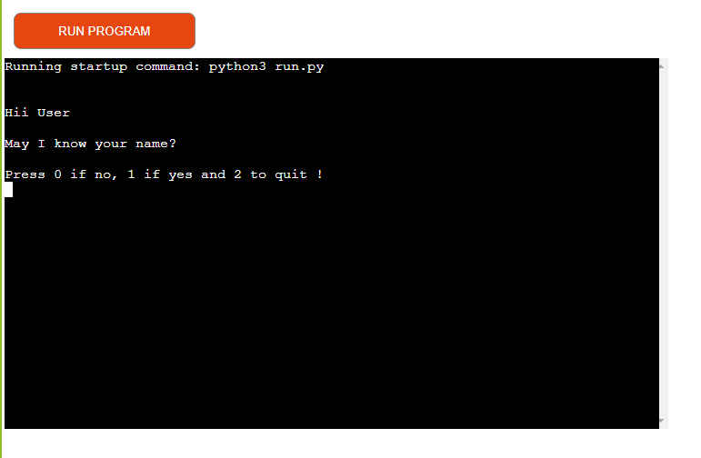
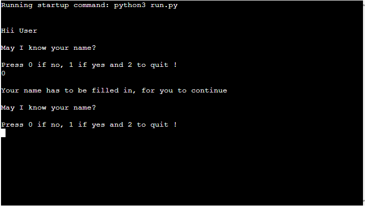
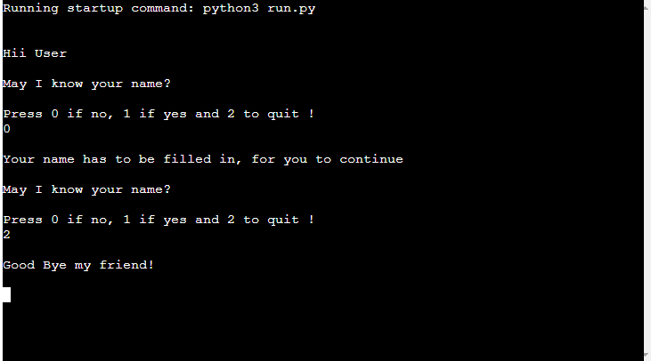
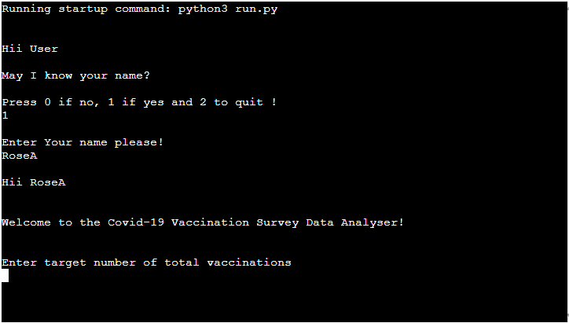
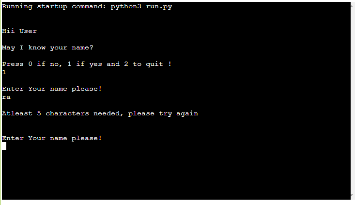

# COVID-19 Vaccine Survey Data Analyzer (CVSDA)

## Introduction

The CVSDA is a command-line interface application built purely in python, that interacts with a user who avails a CSV (comma separated values) list of covid-19 vaccination data around the world.

### Application Goal

To gather insights from covid-19 vaccination survey data results, as the world recovers from covid and continues to fight against the coronavirus.

### Target Audience

* Travelers who might want to tour well vaccinated countries.

* Researchers of vaccines used globally.

* International Health organizations tracking global vaccination.

* Vaccine Manufacturers tracking vaccines used globally.

### User Stories

* As a Traveler, I want to know which countries have the most vaccinated population.

* As a Researcher, I want to know which vaccines have been used the most in the world.

* As an International Health Organization, we would want to know which countries are vaccinating their populations and with which vaccines.

* As a vaccine manufacturer, I want to know which vaccines are being used on a large scale globally.

## Structure
-------
 The features involved in the CVSDA application include the following.

** The main menu**

* The user is prompted to identify him/herself before he/she can access the data analysis module of the application.

** Enter Zero **

* The option allows the user to select no as an answer after request by the application to enter name. With this option, the application with further prompt the user to enter their name if they are to continue using the application.

** Enter Two **

* The option 2 allows the user to quit using the application in case they do not feel like providing their name or credentials to the application.

** Enter One **

* The option 1 allows the user to enter their name after which they can proceed to analyze the covid data based on what numbers they choose as criteria.

** Name Validation**

The application checks the input that is manually input by the user. The application then goes a head to check that the name input by the user has at least 5 characters. Anything less than the 5 charachters returns a message requesting for the user to set the name to right number of characters.

** Data Analysis**

* The application allows the user to enter data in the form of intergers or numbers for analysis after the user has provided the correct name format. If the user provides anything other than that, the application returns a message indicating invalid input.

